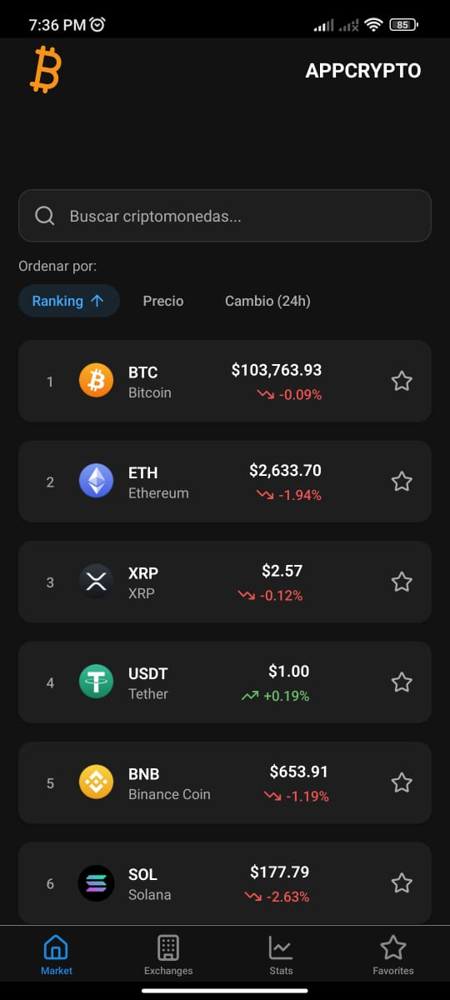

# AppCrypto

AppCrypto es una aplicación móvil que proporciona información actualizada sobre criptomonedas, incluyendo precios, capitalización de mercado, volumen de trading, estadísticas sociales y más. La aplicación está diseñada para ayudar a los usuarios a mantenerse informados sobre el mercado de criptomonedas y tomar decisiones basadas en datos actualizados.

## Capturas de Pantalla

<div align="center">
  
  <p><i>Pantalla principal mostrando el listado de criptomonedas con precios actualizados</i></p>
</div>

La aplicación presenta una interfaz moderna y fácil de usar con las siguientes características:

- Listado de criptomonedas ordenadas por ranking
- Precios actualizados en tiempo real
- Porcentajes de cambio de precios en las últimas 24 horas
- Navegación intuitiva mediante pestañas inferiores
- Opción para marcar criptomonedas como favoritas
- Modo oscuro para mayor comodidad visual

## Descargar APK

<div align="center">
  <a href="https://expo.dev/artifacts/eas/phCPghRtFbDCAz15F98G1Y.apk">
    
  </a>
</div>

## Propósito

El propósito principal de esta aplicación es proporcionar a los usuarios:

- Acceso rápido a los precios actuales de criptomonedas en USD
- Información detallada sobre cada criptomoneda
- Estadísticas de mercado global
- Datos sobre los exchanges y mercados donde se negocian estas criptomonedas
- Estadísticas sociales (Twitter, Reddit) para evaluar la actividad de la comunidad
- Capacidad para guardar criptomonedas favoritas para seguimiento rápido

## Tecnologías Utilizadas

- **TypeScript**: Para desarrollo tipado y mantenible
- **React Native**: Framework para desarrollo móvil multiplataforma
- **Expo**: Para simplificar el desarrollo y despliegue
- **Expo Router**: Para la navegación y gestión de rutas
- **React Navigation**: Para la navegación entre pantallas
- **API de CoinLore**: Como fuente de datos de criptomonedas

## Arquitectura

El proyecto sigue una arquitectura limpia con separación de responsabilidades:

### Estructura de Carpetas

```
/app                  # Vistas principales (usando Expo Router)
  /(tabs)             # Pestañas principales
  /crypto             # Vistas relacionadas con criptomonedas
/components           # Componentes reutilizables
  /cryptoDetail       # Componentes para la vista de detalle
  /marketStats        # Componentes para estadísticas de mercado
/hooks                # Hooks personalizados para lógica de estado
/models               # Modelos de datos (TypeScript)
/services             # Servicios para interactuar con APIs
/utils                # Utilidades generales y funciones auxiliares
```

### Patrones de Diseño

- **Singleton**: Implementado en ApiClient para garantizar una única instancia
- **Factory Method**: Utilizado en todos los modelos con métodos `fromApiResponse`
- **Repository**: Servicios que abstraen la comunicación con APIs
- **Dependency Injection**: Inyección de servicios en hooks y componentes

## Modelos

Los modelos son el núcleo de la aplicación, representando las entidades principales:

### Cryptocurrency

Representa la información básica de una criptomoneda:

```typescript
export class Cryptocurrency {
  id: string;
  name: string;
  symbol: string;
  rank: number;
  priceUsd: number;
  percentChange24h: number;
  marketCapUsd: number;
  volume24h: number;

  // ... métodos
}
```

### CryptocurrencyDetails

Extiende `Cryptocurrency` con información detallada:

```typescript
export class CryptocurrencyDetails extends Cryptocurrency {
  percentChange1h: number;
  percentChange7d: number;
  percentChange30d?: number;
  circulatingSupply: number;
  maxSupply?: number;
  totalSupply?: number;
  // ... más propiedades y métodos
}
```

### Exchange y Market

Representan exchanges y mercados donde se negocian criptomonedas:

```typescript
export class Exchange {
  id: string;
  name: string;
  volumeUsd24h: number;
  activePairs: number;
  url: string;
  country: string;
  // ... métodos
}

export class Market {
  name: string;
  pair: string;
  volumeUsd24h: number;
  price: number;
  percentVolume: number;
  // ... más propiedades y métodos
}
```

## Servicios

Los servicios actúan como intermediarios entre la aplicación y las APIs externas:

### ApiClient

Cliente HTTP base que implementa el patrón Singleton:

```typescript
export class ApiClient {
  private static instance: ApiClient;
  private baseUrl: string;

  private constructor() {
    this.baseUrl = 'https://api.coinlore.net/api';
  }

  public static getInstance(): ApiClient {
    if (!ApiClient.instance) {
      ApiClient.instance = new ApiClient();
    }
    return ApiClient.instance;
  }

  // ... métodos para realizar peticiones HTTP
}
```

### CryptocurrencyService

Servicio principal para obtener información de criptomonedas:

```typescript
export class CryptocurrencyService {
  private apiClient: ApiClient;

  constructor() {
    this.apiClient = ApiClient.getInstance();
  }

  async getTopCryptocurrencies(
    start: number = 0,
    limit: number = 20
  ): Promise<Cryptocurrency[]> {
    // ... implementación
  }

  async getCryptocurrencyDetails(id: string): Promise<CryptocurrencyDetails> {
    // ... implementación
  }

  // ... otros métodos
}
```

## Hooks Personalizados

Los hooks encapsulan la lógica de negocio y estado:

```typescript
export function useCryptocurrencies() {
  const [cryptocurrencies, setCryptocurrencies] = useState<Cryptocurrency[]>(
    []
  );
  const [isLoading, setIsLoading] = useState(true);

  // ... implementación de la lógica de carga y filtrado

  return {
    cryptocurrencies,
    isLoading,
    // ... otras propiedades y métodos
  };
}
```

## Flujo de la Aplicación

1. **Inicio**: La aplicación comienza cargando una lista de criptomonedas populares
2. **Navegación**: El usuario puede navegar entre las pestañas (Criptomonedas, Mercado, Exchanges)
3. **Búsqueda**: El usuario puede buscar criptomonedas específicas
4. **Detalle**: Al seleccionar una criptomoneda, se muestra información detallada
5. **Favoritos**: El usuario puede marcar criptomonedas como favoritas para acceso rápido

## Características Principales

- Visualización de precios en USD en tiempo real
- Gráficos de cambio de precio en diferentes periodos
- Información detallada de capitalización, volumen y suministro
- Estadísticas sociales de comunidades como Twitter y Reddit
- Información sobre exchanges y mercados donde se comercia cada criptomoneda
- Sistema de favoritos para seguimiento de criptomonedas de interés

## Endpoints de API Implementados

La aplicación utiliza los siguientes endpoints de la API de CoinLore:

- `/api/global/`: Estadísticas globales del mercado
- `/api/tickers/`: Lista de criptomonedas paginada
- `/api/ticker/{ID}`: Detalles de una criptomoneda específica
- `/api/coin/markets/?id={ID}`: Mercados de una criptomoneda específica
- `/api/exchanges/`: Lista de exchanges
- `/api/exchange/?id={ID}`: Detalles de un exchange específico
- `/api/coin/social_stats/?id={ID}`: Estadísticas sociales de una criptomoneda

## Ejecución del Proyecto

### Requisitos Previos

- Node.js (v14 o superior)
- npm o yarn
- Expo CLI

### Instalación

```bash
# Clonar el repositorio
git clone https://github.com/tu-usuario/appcrypto.git
cd appcrypto

# Instalar dependencias
npm install
# o
yarn install

# Iniciar el proyecto
npx expo start
npm start
# o
yarn start
```

## Notas de Desarrollo

- La aplicación está diseñada para ser responsiva en diferentes tamaños de pantalla
- Se han implementado estrategias de caché para minimizar las llamadas a la API
- La estructura del proyecto sigue los principios SOLID y prácticas de código limpio
- Toda la documentación del código está disponible en español mediante JSDoc

## Contribuciones

Las contribuciones son bienvenidas. Por favor, abre un issue para discutir los cambios propuestos o crea un pull request con tus mejoras.

## Licencia

Este proyecto está licenciado bajo MIT.
